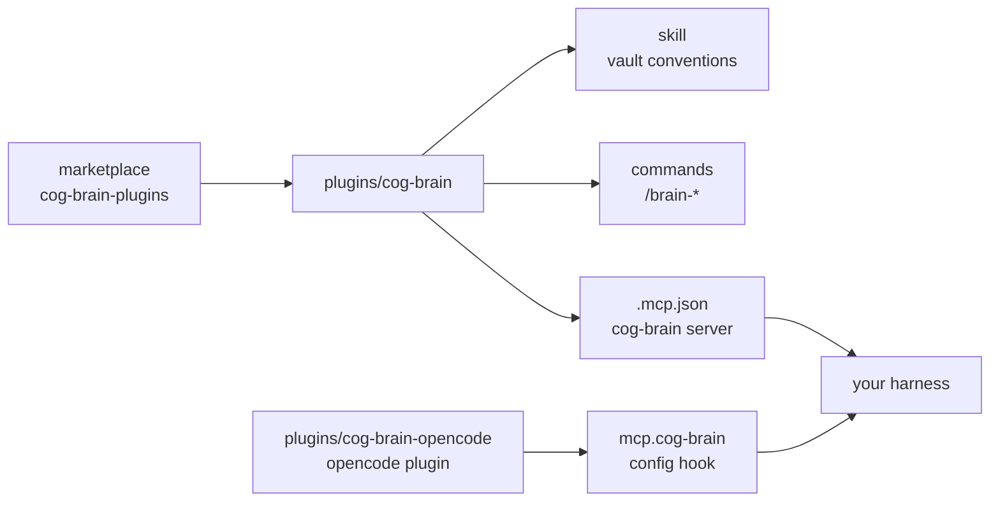

<div align="center">

# 🧩 cog-brain-plugins

**Harness plugins for [cog-brain](https://github.com/cog-sh/cog-brain) — the agent-agnostic second brain.**

One marketplace. A plugin per harness. Works with omp, Claude Code, opencode, and anything that speaks MCP.


</div>

---

## Install

### oh-my-pi (omp)

```bash
omp plugin marketplace add cog-sh/cog-brain-plugins
omp plugin install cog-brain@cog-brain-plugins
```

Or in the TUI: `/marketplace add cog-sh/cog-brain-plugins` →
`/marketplace install cog-brain@cog-brain-plugins`, then `/reload-plugins`.
Restart the session for newly installed tools/hooks.

### Claude Code

```bash
claude plugin marketplace add cog-sh/cog-brain-plugins
claude plugin install cog-brain@cog-brain-plugins
```

### opencode

```bash
git clone https://github.com/cog-sh/cog-brain-plugins
cd cog-brain-plugins/plugins/cog-brain-opencode
./install.sh                    # global; --project <dir> for one project
```

No `opencode.json` edit: the plugin declares the MCP server itself. Restart opencode,
then `opencode mcp list` → `✓ cog-brain connected`. See
[`plugins/cog-brain-opencode/README.md`](plugins/cog-brain-opencode/README.md).

### Any other MCP client

Paste this into the client's MCP config — nothing to clone:

```json
{
  "mcpServers": {
    "cog-brain": {
      "type": "stdio",
      "command": "uvx",
      "args": ["--from", "git+https://github.com/cog-sh/cog-brain", "cog-brain"]
    }
  }
}
```

The snippet sets no backend: the server reads `COG_BRAIN_*` from its environment
(your shell or the harness), defaulting to `sqlite` when unset.

## What the plugin gives you

| Path | Role |
| --- | --- |
| `.mcp.json` | registers the `cog-brain` MCP server (stdio, via `uvx`) |
| `skills/cog-brain/SKILL.md` | the vault conventions the agent follows |
| `/brain-search` | retrieve and answer **from the vault** |
| `/brain-capture` | save durable knowledge |
| `/brain-ingest` | turn a raw source into linked pages |
| `/brain-index` | refresh and report index health |
| `/brain-lint` | broken links · orphans · stubs · schema gaps |
| `/brain-graph` | hubs, orphans, and how a note connects |
| `evals/` | acceptance suite for `claude plugin eval` |



### opencode layout

opencode has no marketplace, so `plugins/cog-brain-opencode/` ships its own installer and
a `package.json`:

| Path | Role |
| --- | --- |
| `cog-brain.js` | the plugin — `config` hook declares `mcp["cog-brain"]`, env-free |
| `install.sh` | copies plugin + skill + commands into `~/.config/opencode/` (or a project) |
| `skills/`, `commands/` | **not** stored here — copied from `plugins/cog-brain/` at install time |

Same skill, same `/brain-*` commands, same server — only the wiring differs.

## Conventions the skill enforces

Four page types (`source` · `entity` · `concept` · `synthesis`), link the first
mention of every concept **both directions**, five typed relations, the ingest
contract — *nothing is ingested until it is linked* — and the contradiction rule:
never overwrite, record both positions dated.

## Evals

```bash
cd plugins/cog-brain
claude plugin eval .        # Claude Code v2.1.269+; each run is a model call
```

Every case runs with **and without** the plugin; `Δ` is what the plugin contributes.
See [`plugins/cog-brain/evals/README.md`](plugins/cog-brain/evals/README.md).

## Configuration

Set these as environment variables (the plugin declares none, so they are inherited
by the server on spawn), or in the plugin's `.mcp.json` `env`.

| Variable | Meaning | Default |
| --- | --- | --- |
| `COG_BRAIN_VAULT` | Obsidian vault root | `~/SECOND_BRAIN` |
| `COG_BRAIN_BACKEND` | `sqlite` · `qdrant` · `markdown` | `sqlite` |
| `COG_BRAIN_STATE_DIR` | index + manifest location | `~/.local/state/cog-brain` |
| `COG_BRAIN_MCP_SOURCE` | source `uvx` launches the server from | `git+https://github.com/cog-sh/cog-brain` |

## Add another harness

Marketplace harnesses (omp, Claude Code): create `plugins/<name>/` with the same shape
(`.mcp.json`, `skills/`, `commands/`, `.claude-plugin/plugin.json`) and add an entry to
both catalogs.

Harnesses without a marketplace (opencode): create `plugins/<name>-<harness>/` with a
`package.json`, the plugin/code file, and an `install.sh` that copies the shared skill
and commands out of `plugins/cog-brain/` — no catalog entry, the installer is the
install path. Details in [`AGENTS.md`](AGENTS.md).
